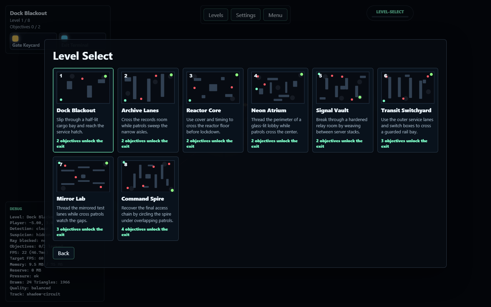
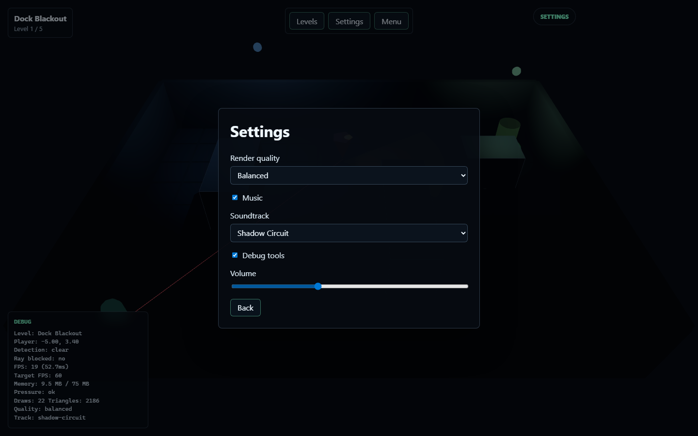
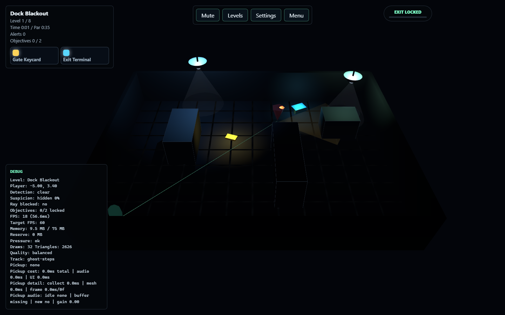
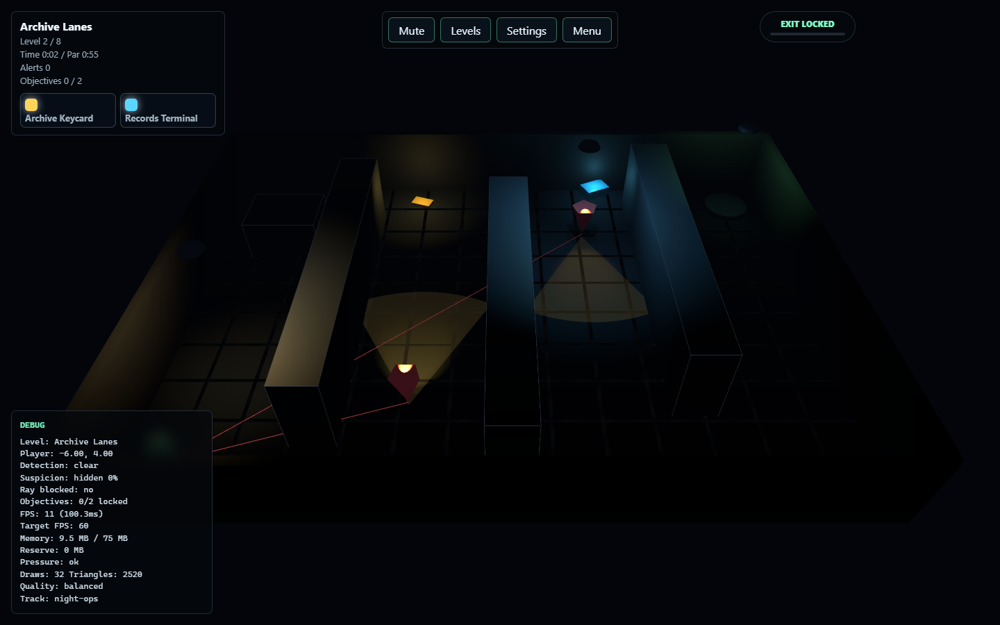
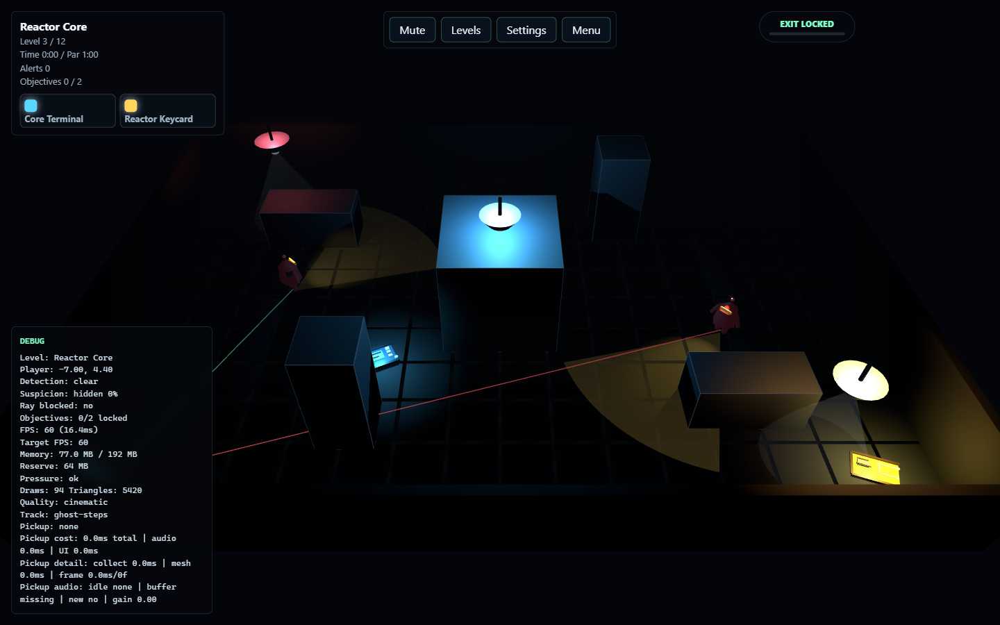
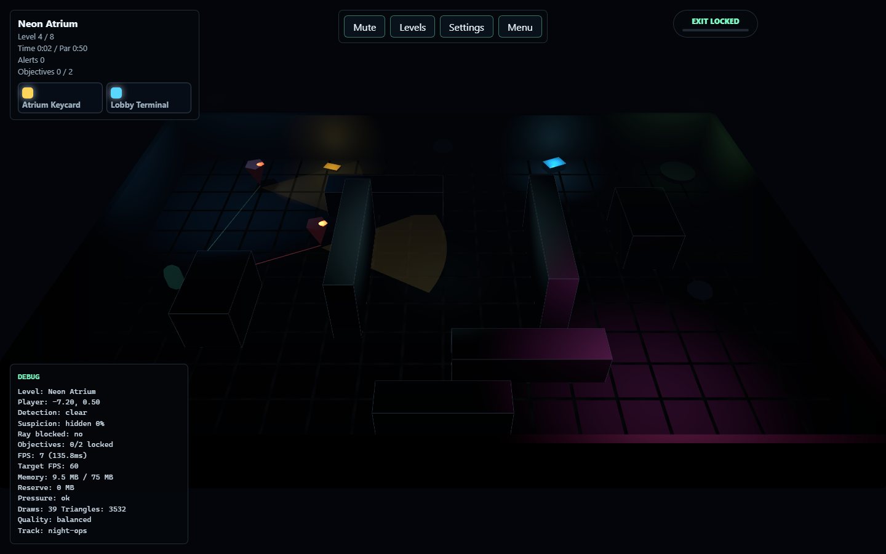
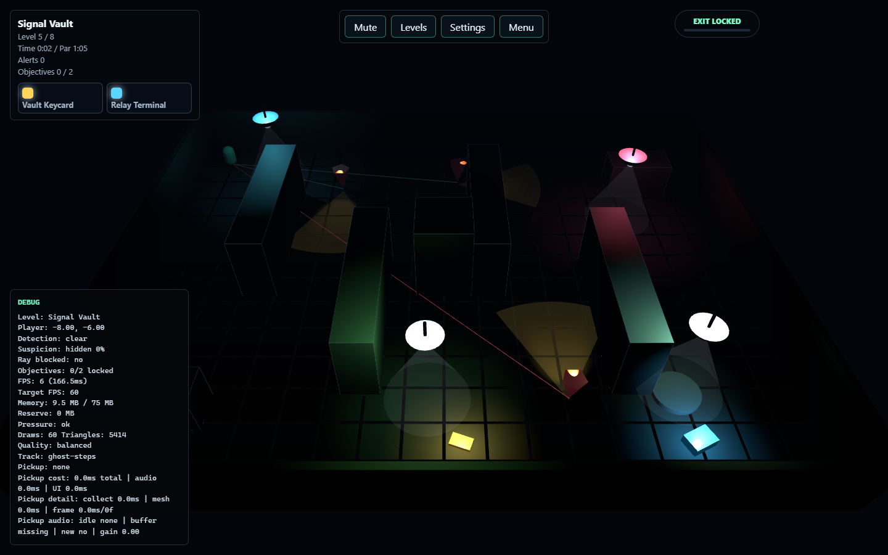

# Shadow Circuit

Shadow Circuit is a local Three.js stealth game prototype. You sneak through dark rooms, avoid patrolling guards and their visible sight cones, use cover to block line-of-sight rays, and reach the exit pad across five levels.

## Current Features

- Five playable levels: Dock Blackout, Archive Lanes, Reactor Core, Neon Atrium, and Signal Vault.
- Menu, settings, retry, and level-complete flows.
- Level select menu with generated level preview images.
- Guard patrols with visible cones and raycast line-of-sight detection.
- Suspicion meter with alert recovery and detection leniency settings.
- Guard collision: touching a guard now triggers detection.
- Objective-gated exits across all levels with keycards, terminals, HUD chips, and collection notices.
- Dark-room lighting, emissive goals, shadows by quality setting, and simple custom assets.
- Shader-based floor detail, goal beacons, and contact shadows.
- Custom generated soundtrack with four selectable tracks, including a compressed higher-tempo replacement candidate.
- Balanced default rendering with a 75 MB browser heap cap and Memory first fallback.
- On-screen debug panel with FPS, memory, draw calls, player position, and detection state.
- Console logs for game phase, level loads, settings, audio, and detection events.
- Unit tests, level route validation, and browser smoke coverage.

## Controls

- Move: `WASD` or arrow keys.
- Toggle menu: `Esc`.
- Toggle debug tools: `F1`.

## Run Locally

```powershell
npm install
npm run dev
```

Open:

```text
http://127.0.0.1:5173/
```

## Scripts

```powershell
npm run dev          # Start local Vite dev server
npm run build        # Type-check and build production assets
npm run test:run     # Run Vitest unit tests
npm run test:levels  # Validate authored level routes
npm run test:browser # Run Playwright smoke test against the local dev server
npm run screenshots   # Capture README screenshots into docs/images
npm run verify       # Run unit tests, level validation, and production build
npm run assets:audio # Regenerate the custom soundtrack; ffmpeg also rebuilds the compressed MP3 candidate
```

`npm run test:browser` expects the dev server to be running at `http://127.0.0.1:5173/`. It runs headed by default for realistic frame pacing; set `SMOKE_HEADLESS=true` if a headless smoke pass is needed.

## Project Structure

```text
src/game/                 Core game systems
src/assets/               Generated runtime assets
scripts/                  Validation, browser smoke, and asset generation scripts
docs/shadow-circuit-*.md  Focused design and system notes
```

## Checkpoint Workflow

Before pushing gameplay changes:

```powershell
npm run verify
npm run test:browser
```

Then commit and push the checkpoint.

## Screenshots

### Menus





### Levels











## Documentation

- `docs/shadow-circuit-overview.md`
- `docs/shadow-circuit-stealth.md`
- `docs/shadow-circuit-performance.md`
- `docs/shadow-circuit-levels.md`
- `docs/shadow-circuit-assets.md`
- `docs/shadow-circuit-level-select.md`
- `docs/shadow-circuit-soundtrack.md`
- `docs/shadow-circuit-memory-budget.md`
- `docs/shadow-circuit-shaders.md`
- `docs/shadow-circuit-06-12-2026-improve-decision.md`
